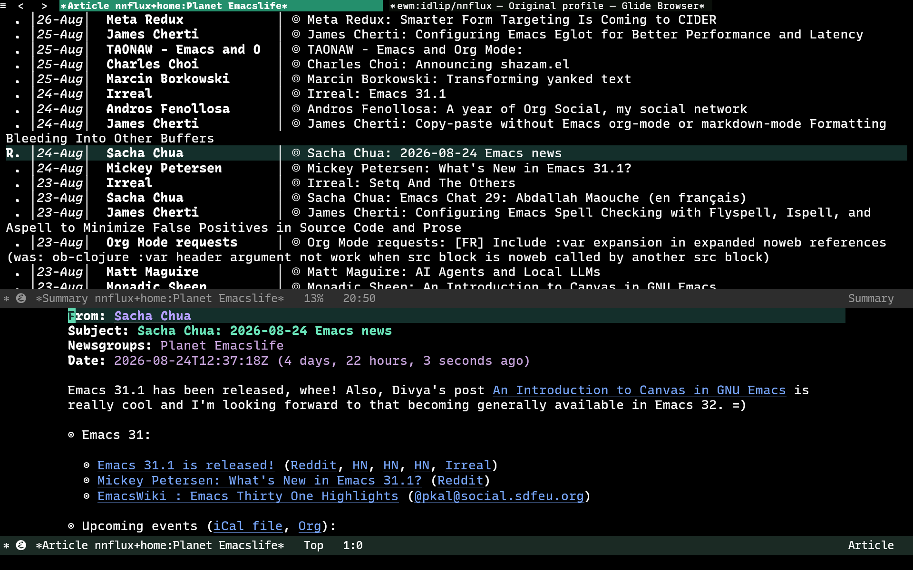

#+TITLE: nnflux: Gnus Miniflux Reader

Read feeds from self-hosted [[https://miniflux.app/][Miniflux]] server through Gnus, as normal Gnus groups.

#+begin_quote
  This package was written with the help of AI for accomplishing its purpose.
#+end_quote

* Features

- One Gnus group per Miniflux feed.
- Read/unread marks sync both ways with the server.
- Star (Gnus =!= "tick" mark) syncs both ways with Miniflux bookmarks.
- Server is treated as the source of truth on pull (~M-g~ or re-entering a group): local marks for any
  article the server reports on are set to match it, so there is no manual conflict resolution.
- Token auth (~X-Auth-Token~) or HTTP Basic Auth (account username/password).
- No local article database, articles are fetched live into memory each time you open a group.

-------

#+caption: Gnus screenshot showing nnflux group for PlanetEmacs post

- Screenshot shows the Gnus summary and article buffer for nnflux group of PlanetEmacs post by Sacha Chua.

* Install

** With =use-package= and =:vc= (Emacs 30+)

#+begin_src emacs-lisp
(use-package nnflux
  :vc (:url "https://github.com/idlip/nnflux" :rev :newest)
  :after gnus)
#+end_src

** Manual

Download =nnflux.el= and load it directly:

#+begin_src emacs-lisp
(add-to-list 'load-path "/path/to/nnflux")
(require 'nnflux)
#+end_src

* Setup

With an API token (Miniflux: Settings -> API Keys -> Create a new API key):

#+begin_src emacs-lisp
  (setq nnflux-address "https://miniflux.domain.tld")
  (setq gnus-select-method
        '(nnnil ""))
  (setq gnus-secondary-select-methods
        '((nnflux "home"
           (nnflux-address "https://miniflux.domain.tld")
           (nnflux-token "your-api-token"))

          ;; to flatten all miniflux feeds into one group.
          ;; refer: info:gnus#Combined Groups
          (nnvirtual "all-feeds"
                     (nnvirtual-component-regexp "^nnflux\\+home:"))))
#+end_src

Or with your account username/password instead of a token:

#+begin_src emacs-lisp
(setq gnus-secondary-select-methods
      '((nnflux "home"
         (nnflux-address "https://miniflux.domain.tld")
         (nnflux-user "your-username")
         (nnflux-password "your-password"))))
#+end_src

Or leave both unset and store the credential in =auth-source= (=~/.authinfo=, =~/.authinfo.gpg=, etc.)
instead, keyed on =nnflux-address='s host. For an API token, use a login of =api-token= (also accepts
=token= or =nnflux-token=) so it's recognized as a token rather than a password:

#+begin_src conf
machine miniflux.domain.tld login api-token password your-api-token
#+end_src

Any other login is treated as a Basic Auth username/password pair.

* Usage

All through normal Gnus keys, once subscribed to a group:

- Mark read/unread: normal Gnus commands.Pushed to the server when you leave the group (~q~).
- Star: Gnus's tick mark (~!~ to tick, ~M-u~ to untick).
- Pull server changes (e.g.read on the Miniflux phone app): ~M-g~ on the group, or re-enter it.
- Describe a feed (title, description, site url): ~d~ (~gnus-group-describe-group~) in the Group buffer.
- Subscribe to a new feed: ~M-x nnflux-subscribe-feed~, then enter a feed URL. Gnus's normal new-group prompt picks it up from there (equivalent to pressing ~g~).
- Search: ~G G~ runs Miniflux's own full-text search across your feeds (or the marked/current group, if narrowed). Only matches within each feed's normal fetch window (~nnflux-fetch-limit~) are reachable; anything older is reported as skipped rather than silently dropped. Requires Emacs new enough to have ~gnus-search.el~.

* Extending nnflux

nnflux ships a small, fixed set of commands (subscribe, search, describe, mark sync) for integrating with gnus specifically.

For anything else [[https://miniflux.app/docs/api.html][Miniflux's API]] supports, check for nnflux helper functions (=C-h f nnflux-= ): ~nnflux--pick-server~, ~nnflux--use-server~, and ~nnflux--get~/~nnflux--put~/~nnflux--post~

** Refresh a feed right now

Example: refresh a feed right now, picked from a ~completing-read~ list annotated with
each feed's category/site/last-checked/error:

#+begin_src emacs-lisp
  (defun nnflux-refresh-feed ()
    "Ask Miniflux to re-poll one feed URL right now."
    (interactive)
    (let* ((server (nnflux--pick-server))
           (_ (nnflux--use-server server))
           (feeds (nnflux--get "/feeds"))
           (table (make-hash-table :test 'equal))
           (candidates
            (mapcar (lambda (feed)
                      (puthash (alist-get 'title feed) feed table)
                      (alist-get 'title feed))
                    feeds))
           (width (apply #'max (mapcar #'length candidates)))
           (completion-extra-properties
            (list :annotation-function
                  (lambda (c)
                    (let ((f (gethash c table)))
                      (format "%s%s, checked %s"
                              (make-string (- (+ width 3) (length c)) ?\s)
                              (alist-get 'site_url f) (alist-get 'checked_at f))))))
           (choice (completing-read "Refresh feed: " candidates nil t))
           (feed-id (alist-get 'id (gethash choice table))))
      (nnflux--put (format "/feeds/%d/refresh" feed-id) nil)
      (message "nnflux: refreshed feed %d" feed-id)))
#+end_src

=PUT /feeds/{id}/refresh= is synchronous, press ~M-g~ on the group to pull them into Gnus.
Ideally miniflux should be configured to poll globally as desired.

* Roadmap / TODO

Things that could be added or improved, roughly in order of how naturally they fit both Gnus's and
Miniflux's own concepts:

- [X] *Enclosures as attachments*.

  Podcast/media enclosures on entries, shown as clickable links in the article body (the pattern
  ~nnrss.el~ already uses for the same problem). Easy to do =w= to save or embark-act to play via mpv

- [ ] *E2E & Unit Testing*

  Add ERT tests so development is smoother and deterministic than manual workflow test.

- [ ] *Gnus Search*

  =G G= to search and find feed using miniflux's default search method.

- [ ] *Categories -> Gnus Topics*.

  Auto-place each feed's group under a ~gnus-topic-mode~ topic named after its Miniflux category.
  Can provide a variable to either group or not, so user can control if they want same synced or have different topic grouping in gnus manually.

- [ ] *Full-archive sync*.

  Gotta figure out gnus-agent method and tweak it. So download and read works as intended

* References

- Miniflux API docs : https://miniflux.app/docs/api.html
- miniflux.el (elfeed-based Miniflux client, sibling project) : https://github.com/bladrome/miniflux.el
- elfeed-protocol (Fever/ownCloud/TT-RSS/NewsBlur protocols for elfeed) : https://github.com/fasheng/elfeed-protocol
- elfeed : https://github.com/emacs-elfeed/elfeed

* License

GPL-3.0-or-later, matching Gnus/Emacs itself. See [[file:LICENSE][LICENSE]].
